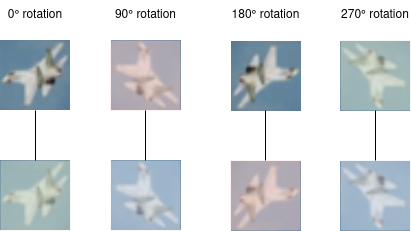
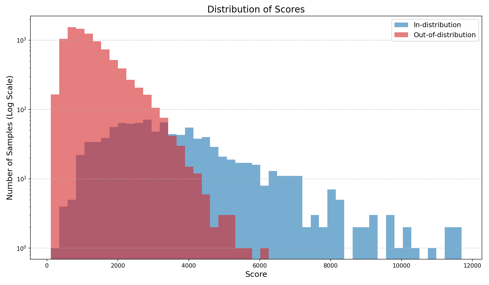

# Music outlier detection via Contrastive Learning

In this repository the principals of contrastive learning used for image outlier detection are transfered to the music domain.
The basic use-case to train a neural network that is able to predict whether you will enjoy a music file, while being trained only on other music,
which you enjoy.

The network architecture and training pipeline is heavily based on:

- Tack, Jihoon, et al. "Csi: Novelty detection via contrastive learning on distributionally shifted instances." 
    Advances in neural information processing systems 33 (2020) 
    - [Neurips link](https://proceedings.neurips.cc/paper/2020/file/8965f76632d7672e7d3cf29c87ecaa0c-Paper.pdf)
    - [ArXiv link](https://arxiv.org/pdf/2007.08176.pdf)
    - [GitHub repository](https://github.com/alinlab/CSI)

The documentation of this repository can be found here: [Documentation](https://jvkgithub.github.io/outlier_detection/)

## Planned updates
- training on custom data

## 1. Contrastive Learning
### Image domain
The goal of training is to be able to recognize outliers, even though during training only in-distribution are available. 
One promising method of teaching the network distinguishing features of the in-distribution class is contrastive learning.

The main idea is to use strong distortions on duplicates of the input image as synthetic out-of-distribution samples.

#### Contrastive Learning example:


In this example the strong distortion is a rotation: 
- The input image is duplicated and rotated so that we end up with four image rotated by 0°, 90°, 180° and 270° 
- Next these four images are duplicated once more, so we end up with 4 images pairs 
- Each member of a pair receives an image augmentation, such as color jitter or random resized crop.
- Each training batch consists of several of these mini-batches

The main training loss is the Normalized Temperature-Scaled Cross-Entropy (NT-Xent), which guides the network to learn image embeddings that are
similar for image pairs, but different for other samples.

For inference, the norm of the final image embedding is used as a classification score. In-distribution samples will have likely result in a 
large norm, while out-of-distribution samples will likely result in small norm.

### Audio domain
For the audio domain in this project the audio samples are converted into [Mel spectograms](https://en.wikipedia.org/wiki/Mel-frequency_cepstrum).
In this way, the neural network inputs are still images and a similar network can be used. However, the transforms and data augmentations have to be
adjusted. For example, spectograms are always oriented the same way, so rotation does not make much sense. Instead, white noise is added the audio 
signal before the spectogram conversion. Other data augmentations are based on 
[Contrastive Learning of Musical Representations](https://arxiv.org/pdf/2103.09410.pdf) (Spijkervet and Burgoyne, 2021) and include
- Polarity inversion
- Gain decrease
- High/Low pass filtering
- Pitch change
- Reverb

## 2. Benchmarks
### CIFAR-10
The first proof-of-concept is the open source image dataset CIFAR-10. The network is only trained on a single class and evaluated on unseen images of 
all images with a binary classification task, wether the image is in-distribution or out-of-distribution.
To run the benchmark copy the "CIFAR-10 default train conf" dictionary from the default_configs.txt to the train_config.json 
and in the root directory run:
```
python train.py
```
This results in a training run of 1000 epochs with "Plane" as the In-distribution class.

Performance: **AUC: 0.9083**, matching the result of Jihoon et al. (2020) using the norm of the final network embedding as classification score.


### MagnaTagATune subset
The next proof-of-concept is the open source dataset [MagnaTagATune](https://mirg.city.ac.uk/codeapps/the-magnatagatune-dataset) consisting of ~25000
30 seconds music samples, usually used for automated music tagging, but for this case will be used for genre classification in an outlier detection 
setup (since it is much larger than GTZAN). 

Selected genres are:
- classical
- electronic
- rock
- pop
- indian

Audio samples were included if they only had one of the class tags to avoid overlap. The dataset can be recreated by running:
```
python mtt_creation.py
```
which will download the official MagnaTagATune dataset, collect the samples from this projects' subset and organise them in a train and test set. 
To run the benchmark copy the "Default MTT dataset evaluation" dictionary from the default_configs.txt to the train_config.json 
and in the root directory run:
```
python train.py
```
This results in a training run of 1000 epochs with "Classical" as the In-distribution class.
Performance: **AUC: 0.9083** 
## Appendix
To avoid long input string in the terminal when running the training or evaluation pipeline, a configuration file is used:
### Training configuration
```
- dataset_name:         Name of the training dataset, can be cifar10, mtt or custom
- model_name:           Model architecture, can be resnet or efficientnet
- model_scale:          Version of the model, for ResNet can be 0 to 5, for EfficientNet can be 0 to 8. Higher index corresponds to larger model.
                        Highest index (ResNet-5 or EfficientNet-8) is a special index for small input images (like CIFAR-10), 
                        which uses the smallest network and reduces downsampling operations.
- input_img_size:       Size of input image, given in [height, width]
- epochs:               Number of epochs for training
- batchsize:            Number of samples per batch
- val_size:             Proportion of the dataset to include in the validation split (e.g. 0.1 for 10%)
- path_checkpoint:      Path to save model checkpoints
- lr:                   Learning rate
- transforms:           Type of transformations to apply on images. Should be "image" or "audio"
- save_checkpoint_epochs: Number of epochs interval to save model checkpoints
- eval_test_step:       Steps interval to evaluate the model on the test set, set higher then epochs to avoid evaluation during training
- optimizer:            Optimizer type for training, can be "adamw" or "sgd"
- lr_scheduler:         Type of learning rate scheduler, can be "cosine" or null
- weight_decay:         Weight decay for the optimizer
- log_dir:              Directory to save logs.
- deterministic_run:    If true, the training will be deterministic
- seed:                 Seed for random number generation for use in deterministic run
- target_class:         Target class for binary classification
- duplication_factor:   Factor by which samples of the target class are duplicated
- model_weights:        Can be set to path to the .pth file or "imagenet" for default imagenet weights. Set to null for training from scratch
- device:               Device for training, can be "cuda" or "cpu"
- warmup_epochs:        Number of warm-up epochs for ramping up the learning rate
- num_workers:          Number of worker processes for data loading
- path_data:            Root path to the dataset directory
- dataset_mean:         List of color channel-wise mean. Can be set to null if cifar10 is selected for dataset_name c and will automatically be
                        inferred from precalculated values.
- dataset_std           List of color channel-wise standard deviation. Can be set to null if cifar10 is selected for dataset_name c and will 
                        automatically be inferred from precalculated values.
- loss_weights:         Weights for different components of the loss function:
    - weight_sim:      Weight for similarity loss
    - weight_shift:    Weight for shift loss
    - weight_cls:      Weight for classification loss
    - weight_norm:     Weight for normalization loss
- sample_rate           Sampling rate of the audio file
- sample_len            Length of the audio sample. Not whole audio files are fed into the network but pieces of it.
```

## Evaluation configuration:
```
- evaluation_mode:      Mode of evaluation, can be "dataset" for a complete dataset evaluation or "image" or "audio" for single files.
- dataset_name:         Name of the dataset to evaluate the model on, can be cifar10, mtt or custom
- model_name:           Model architecture to be used, can be resnet or efficientnet
- model_scale:          Version of the model, for ResNet can be 0 to 5, for EfficientNet can be 0 to 8. Higher index corresponds to larger model.
                        Highest index (ResNet-5 or EfficientNet-8) is a special index for small input images (like CIFAR-10), 
                        which uses the smallest network and reduces downsampling operations.
- duplication_factor:   Factor by which samples of the target class are duplicated
- input_img_size:       Size of input image, given in [height, width]
- batchsize:            Number of samples per batch during evaluation
- path_checkpoint:      Path to the trained model checkpoint (.pth file) for evaluation
- transforms:           Type of transformations to apply on images during evaluation. Should be "image" or "audio"
- target_class:         Target class for binary classification
- device:               Device for evaluation, can be "cuda" or "cpu"
- num_workers:          Number of worker processes for data loading during evaluation
- path_data:            Root path to the dataset directory, image or .mp3 track for evaluation.
- dataset_mean:         List of color channel-wise mean. If cifar10 or mtt is selected for dataset_name can be set to null and will automatically be
                        inferred from precalculated values.
- dataset_std           List of color channel-wise standard deviation. If cifar10 or mtt is selected for dataset_name can be set to null and will
                        automatically beinferred from precalculated values.
- sample_rate           Sampling rate of the audio file
- sample_len            Length of the audio sample. Not whole audio files are fed into the network but pieces of it.
```